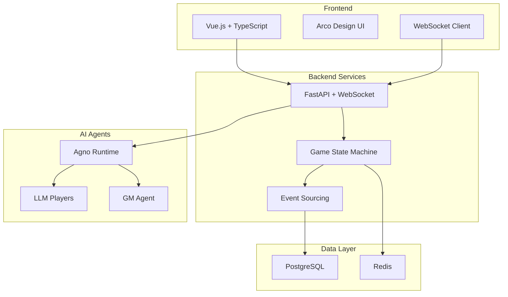

# 赛博狼人杀 (Cyber Werewolves)

> 人机混战的多智能体狼人杀平台

一个支持**人类玩家 + LLM 玩家**同场竞技的实时狼人杀游戏，具备可验证公平性、低延迟和完整回放功能。

## 🎮 核心特性

- **🤖 人机混战**: 人类玩家与AI智能体同场对战
- **⚡ 实时对战**: WebSocket实时通信，低延迟游戏体验
- **🔍 可验证公平**: 事件溯源机制，完整审计轨迹
- **📱 跨平台支持**: 响应式Web界面，支持PC和移动端
- **🎭 丰富角色**: 支持村民、狼人、预言家、女巫、守卫等多种角色
- **📊 数据回放**: 基于事件日志的完整游戏回放
- **🔐 信息隔离**: 严格的Agent信息可见性控制

## 🏗️ 系统架构



## 🚀 快速开始

### 环境要求

- Docker & Docker Compose
- Node.js 18+ (可选，用于本地开发)
- Python 3.11+ (可选，用于本地开发)

### 一键启动

```bash
# 克隆项目
git clone <repository-url>
cd Cyber_Werewolves

# 初始化环境
make setup

# 启动开发环境
make dev
```

### 手动启动

```bash
# 复制环境配置
cp .env.example .env

# 编辑 .env 文件，配置你的 LLM API Keys
# OPENAI_API_KEY=your-key-here
# ANTHROPIC_API_KEY=your-key-here

# 启动服务
docker-compose up -d
```

### 访问服务

- **🎮 游戏前端**: http://localhost:3000
- **📖 API 文档**: http://localhost:8000/docs
- **🤖 Agent API**: http://localhost:8001/docs

## 📁 项目结构

```
├── apps/
│   ├── api/          # FastAPI 后端服务
│   ├── agents/       # Agno 智能体服务  
│   └── web/          # Vue.js 前端应用
├── packages/
│   ├── sdk-py/       # Python 共享包
│   └── sdk-js/       # TypeScript 共享包
├── infra/
│   └── deploy/       # 部署配置
├── tests/            # 测试文件
└── docs/             # 项目文档
```

## 🎯 游戏玩法

### 基础规则

1. **🌙 夜晚阶段**: 
   - 狼人协商击杀目标
   - 预言家查验玩家身份
   - 女巫使用解药/毒药
   - 守卫保护目标

2. **☀️ 白天阶段**:
   - 公布夜晚结果
   - 自由发言讨论
   - 投票放逐可疑玩家

3. **🏆 胜利条件**:
   - 村民阵营：消灭所有狼人
   - 狼人阵营：数量等于或超过村民

### AI 玩家特色

- **🧠 智能推理**: 基于可见信息进行逻辑分析
- **🎭 角色扮演**: 不同角色有独特的行为模式
- **💬 自然交流**: 与人类玩家自然对话
- **📊 策略决策**: 考虑游戏状态做出最优决策

## 🛠️ 开发指南

### 本地开发

```bash
# 启动数据库和缓存
docker-compose up -d postgres redis

# 后端开发
cd apps/api
pip install -r requirements.txt
uvicorn app.main:app --reload

# 智能体服务
cd apps/agents  
pip install -r requirements.txt
uvicorn main:app --port 8001 --reload

# 前端开发
cd apps/web
npm install
npm run dev
```

### 常用命令

```bash
make dev        # 启动开发环境
make build      # 构建所有容器
make test       # 运行测试
make clean      # 清理环境
make logs       # 查看日志
make db-reset   # 重置数据库
```

### 测试

```bash
# 运行所有测试
make test

# 单独运行后端测试
docker-compose exec api python -m pytest

# 单独运行前端测试
docker-compose exec web npm run test
```

## 📊 性能指标

- **并发支持**: ≥ 3,000 个房间同时在线
- **延迟要求**: 首帧 ≤ 200ms，游戏事件 ≤ 500ms
- **内存优化**: 10k+ 消息虚拟滚动支持
- **可扩展性**: 水平扩展架构设计

## 🔐 安全特性

- **信息隔离**: Agent严格按规则获取可见信息
- **事件验证**: 哈希链验证事件完整性  
- **权限控制**: 细粒度的API权限管理
- **审计日志**: 完整的操作轨迹记录

## 📋 TODO

- [ ] 完善角色技能系统 (女巫、守卫、猎人等)
- [ ] 添加观战和回放功能
- [ ] 实现房间匹配系统
- [ ] 增加游戏统计和排行榜
- [ ] 支持自定义游戏模式
- [ ] 移动端原生应用

## 🤝 贡献指南

1. Fork 项目
2. 创建功能分支 (`git checkout -b feature/AmazingFeature`)
3. 提交更改 (`git commit -m 'Add some AmazingFeature'`)
4. 推送到分支 (`git push origin feature/AmazingFeature`)
5. 创建 Pull Request

## 📄 许可证

本项目采用 MIT 许可证 - 查看 [LICENSE](LICENSE) 文件了解详情。

## 🙏 致谢

- [Agno](https://github.com/agno-agi/agno) - AI智能体框架
- [FastAPI](https://fastapi.tiangolo.com/) - 现代Python Web框架
- [Vue.js](https://vuejs.org/) - 渐进式JavaScript框架
- [Arco Design](https://arco.design/) - 企业级设计语言

---

**🎲 开始你的人机混战狼人杀之旅吧！**