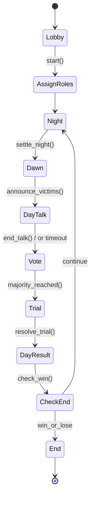

# 赛博狼人杀（Cyber Werewolves）——前端/后端开发文档

> 目标：用 **Agno** 打造“人机混战”的多智能体狼人杀。支持**人类玩家 + LLM 玩家**同场、旁观与复盘；保证**可验证公平性**、**低延迟**与**可重放**。

---

## 0. 快速索引

* [项目概览](#1-项目概览)
* [系统架构](#2-系统架构)
* [技术栈与仓库结构](#3-技术栈与仓库结构)
* [游戏规则与回合机制](#4-游戏规则与回合机制)
* [后端设计](#5-后端设计)

  * [领域模型](#51-领域模型)
  * [事件模型与日志](#52-事件模型与日志)
  * [REST-API](#53-rest-api-契约)
  * [WebSocket 事件协议](#54-websocket-事件协议)
  * [状态机](#55-状态机)
  * [一致性与重放](#56-一致性与重放)
* [前端设计](#6-前端设计)
* [Agno 智能体设计](#7-agno-智能体设计-llm-玩家--gm)
* [安全、公平性与反作弊](#8-安全公平性与反作弊)
* [测试与基准](#9-测试与基准)
* [部署与运维](#10-部署与运维)
* [Roadmap](#11-roadmap)
* [附录：错误码与数据结构](#附录)

---

## 1. 项目概览

**一句话**：一个“可验证、公平、低延迟、可复盘”的混合式狼人杀平台。
**核心能力**：

* 房间匹配、观战、旁白回放（回放 = 从事件日志重建 UI）。
* 昼夜回合制（可配置角色集）：村民、狼人、预言家、女巫、守卫、猎人等。
* **LLM 玩家**与**人类玩家**同场：对话、投票、技能行动受**可见信息约束**；所有决策与上下文有**审计轨迹**。
* **Agno** 驱动的 GM（Game Master）与 LLM 玩家，支持多模型、多模态（文本为主，可扩音频/图像）。

非功能性目标：

* 房间并发 ≥ 3k，p95 **首帧 ≤ 200ms**（纯广播），游戏事件端到端 **≤ 500ms**。
* **事件溯源**（Event Sourcing）+ **可重放**（Deterministic Replay）。
* **长连接**高可用，自动重连与幂等提交。

---

## 2. 系统架构

```mermaid
flowchart LR
  subgraph Client["Web / Mobile (React/Vue + TS)"]
    UI[Game UI] --WS--> GW[(WebSocket Gateway)]
    UI --REST--> API[(REST API)]
  end

  GW --pub/sub--> BUS[(Redis Streams / NATS)]
  API --> SVC[Game Service (FastAPI)]
  API --> AUTH[Auth Service]
  API --> LOBBY[Match/Room Service]
  SVC <--> DB[(PostgreSQL)]
  SVC <--> KV[(Redis)]
  SVC <--> OBJ[(S3 Object Storage)]

  subgraph Agents["Agno Runtime"]
    GM[GM Agent]
    A1[LLM Player Agents...]
  end

  SVC <--> Agents
  Agents --tool io--> SVC
  SVC --events--> BUS
  GW --events--> Client
```

**通信**：

* 控制面（建房、入房、开局、配置）：**REST**。
* 实时面（发言、投票、行动、系统广播）：**WebSocket**。
* 内部事件分发：**Redis Streams / NATS**。
* Agent 调用：gRPC/HTTP（首期走 HTTP）。

---

## 3. 技术栈与仓库结构

**后端**：Python 3.11+、FastAPI、SQLAlchemy、PostgreSQL、Redis、NATS/Redis Streams、Pydantic、Agno。
**前端**：TypeScript、React/Vue（任选其一）、WebSocket、Zustand/Pinia、Tailwind/Shadcn（可裁剪）。
**可观测性**：OpenTelemetry、Prometheus、Grafana、ELK（或 Loki）。
**部署**：Docker Compose（本地）、Helm/K8s（生产）、Terraform（可选）。

**Monorepo 建议**：

```
/cyber-werewolves
  /apps
    /api          # FastAPI 服务（REST + WS 网关也可合并于此）
    /ws-gateway   # 低开销 WS 广播层（可与 api 合并）
    /agents       # Agno 运行时（GM/LLM 玩家）
    /web          # 前端
  /packages
    /proto        # 公共类型/契约（TS/Python shared）
    /sdk-js       # 客户端 SDK
    /sdk-py       # 服务端/Agent SDK
  /infra
    /deploy       # docker-compose, k8s manifests, helm
  /tests
    /e2e
    /load
```

---

## 4. 游戏规则与回合机制

* **阶段**：`Night → Dawn → DayTalk → Vote → Trial → Result`（可配置超时）。
* **可配置角色**：`Villager, Werewolf, Seer, Witch(heal/poison), Guard, Hunter, Idiot...`
* **私聊**：仅狼人夜晚组内可见；GM-玩家的系统私信用于通知技能结果。
* **胜负判定**：所有狼人出局或村民阵营出局（含特殊角色）。
* **超时策略**：超时无发言＝空发言；超时无投票＝自动弃票。
* **可复盘**：日志包含：随机种子、角色分配、每阶段开始/结束、玩家行动、投票矩阵、系统结算。

---

## 5. 后端设计

### 5.1 领域模型

**表（PostgreSQL）**（简化）：

* `users`：`id, username, avatar_url, created_at, banned`
* `rooms`：`id, code, host_id, status(enum: open/playing/closed), max_players, config(jsonb)`
* `room_members`：`room_id, user_id, seat, is_bot, agent_id nullable, joined_at, left_at`
* `games`：`id, room_id, seed, started_at, ended_at, config(jsonb), version`
* `game_players`：`game_id, user_id, seat, role(enum), alive(bool), alignment(enum)`
* `events`（**事件溯源**）：

  * `id, game_id, idx, ts, type, actor(seat|system), payload(jsonb), hash, prev_hash`
* `actions`（冪等提交表，可与 events 合并）：`idempotency_key, request, status, result`
* `agent_sessions`：`id, game_id, seat, model_id, policy(jsonb), trace_url`
* `chat_messages`：`game_id, idx, phase, seat, content, visibility(enum: public/team/system)`

**索引**：`events(game_id, idx)`, `chat_messages(game_id, idx)`, `room_members(room_id)`。

### 5.2 事件模型与日志

**事件类型（示例）**：

* 系统：`GameCreated, RolesAssigned, PhaseChanged, TimerStarted, TimerEnded, PlayerDied, GameEnded`
* 行为：`Speak, Vote, NightAction, Reveal, Appeal, SystemNotice`
* Agent：`AgentDecisionRequested, AgentDecisionProduced`

**不可变日志**：每条事件带 `prev_hash` 构成链，保证回放时可验证完整性。

### 5.3 REST-API 契约

> 提要版（OpenAPI 片段）

```yaml
openapi: 3.0.3
info: { title: Cyber Werewolves API, version: 0.1.0 }
paths:
  /auth/login:
    post:
      requestBody: { required: true, content: { application/json: { schema:
        type: object, properties: { username: {type: string} } } } }
      responses: { "200": { description: OK, content: { application/json: { schema:
        type: object, properties: { token: {type: string}, user: { $ref: "#/components/schemas/User" } } } } } }

  /rooms:
    post:
      security: [{ BearerAuth: [] }]
      requestBody:
        content: { application/json: { schema:
          type: object, properties: { maxPlayers: {type: integer, default: 9}, config: {type: object} } } }
      responses: { "200": { description: Created, content: { application/json: { schema: { $ref: "#/components/schemas/Room" } } } } }

  /rooms/{roomId}/join:
    post:
      security: [{ BearerAuth: [] }]
      responses: { "200": { description: Joined, content: { application/json: { schema: { $ref: "#/components/schemas/Room" } } } } }

  /rooms/{roomId}/start:
    post:
      security: [{ BearerAuth: [] }]
      responses: { "200": { description: Started, content: { application/json: { schema: { $ref: "#/components/schemas/Game" } } } } }

components:
  securitySchemes:
    BearerAuth: { type: http, scheme: bearer, bearerFormat: JWT }
  schemas:
    User:
      type: object
      properties: { id: {type: string}, username: {type: string}, avatarUrl: {type: string} }
    Room:
      type: object
      properties: { id: {type: string}, code: {type: string}, status: {type: string}, maxPlayers: {type: integer}, config: {type: object} }
    Game:
      type: object
      properties: { id: {type: string}, roomId: {type: string}, seed: {type: string}, status: {type: string}, config: {type: object} }
```

### 5.4 WebSocket 事件协议

**连接**：`wss://api.example.com/ws?token=JWT&roomId=...`
**帧格式**（统一 envelope）：

```json
{
  "type": "speak|vote|night_action|system|state|ack|error",
  "reqId": "client-generated-uuid",
  "ts": 1734103700123,
  "payload": { }
}
```

**客户端→服务端（示例）**：

* 发言：`{ "type":"speak", "reqId":"...", "payload": { "content":"..." } }`
* 投票：`{ "type":"vote", "reqId":"...", "payload": { "targetSeat": 5 } }`
* 夜晚行动：`{ "type":"night_action", "reqId":"...", "payload": { "action":"kill|save|poison|inspect|guard", "targetSeat": 7 } }`

**服务端→客户端（示例）**：

* 广播发言：`{ "type":"speak", "payload":{ "seat":3, "content":"...", "phase":"DayTalk", "idx":42 } }`
* 阶段切换：`{ "type":"state", "payload":{ "phase":"Vote", "deadline":1734103740000 } }`
* ACK：`{ "type":"ack", "reqId":"..." }`
* 错误：`{ "type":"error", "reqId":"...", "payload":{ "code":"INVALID_PHASE", "msg":"not in DayTalk" } }`

**可见性**：私聊（狼人夜晚）以 `visibility:"team"` 的事件仅推送给狼人座位席位。

### 5.5 状态机



**定时器**：每阶段创建 `TimerStarted/Ended` 事件；过期自动提交“空发言/弃票”。

### 5.6 一致性与重放

* **事件唯一序号**：`(game_id, idx)`。
* **冪等**：客户端 `reqId` -> 服务端 `idempotency_key`。
* **重放**：从 `events` 读取并按 `idx` 应用，重建任意时间点 UI。
* **可验证性**：`hash(prev_hash + payload + idx + ts)`，防篡改。

---

## 6. 前端设计

**模块**：

* **页面**：登陆、大厅（房间列表/创建/加入）、对战、观战、复盘、设置。
* **状态管理**：`gameState`（phase/players/alive）、`chat`（按 idx 追加）、`room`、`timer`。
* **网络**：REST（axios/fetch）+ WS（心跳、自动重连、线性退避）；消息 **ACK/重放**。
* **可见性**：UI 依据 `visibility` 与 `seat` 渲染；夜晚禁止公共发言。
* **性能**：虚拟滚动聊天；去抖动渲染；WS 单线程队列按 idx 顺序提交。

**组件建议**：

* `ChatPanel`、`VotePanel`、`ActionPanel(Night)`、`PlayersGrid`、`PhaseBanner`、`Timer`
* `SpectatorView`（观战）与 `ReplayView`（按事件 idx 滑动回放）

---

## 7. Agno 智能体设计（LLM 玩家 / GM）

### 7.1 角色与职责

* **GM Agent**（裁判）

  * 接受 `phase_start` 钩子 → 拉取可见信息 → 决策允许操作集合 → 发起/结算夜间行动 → 检查胜负。
  * 工具：`game_state_read`, `commit_event`, `notify_private`, `random(seed)`。

* **LLM Player Agent**（玩家）

  * 能力：`observe(context) -> think -> speak/vote/act`。
  * **可见上下文**：仅等价于人类玩家可见内容（自身身份 + 公共发言 + 夜间队内私聊 + GM 私信结果）。
  * 工具：`say(text)`, `vote(seat)`, `night_action(action, target)`, `ask_gm(question)`。

### 7.2 最小骨架（示意，Python）

```python
# apps/agents/players/wolf.py
from agno.agent import Agent
from agno.models.openai import OpenAIChat
from agno.tools import tool

@tool
def say(text: str) -> dict: ...
@tool
def vote(seat: int) -> dict: ...
@tool
def night_action(action: str, target_seat: int | None = None) -> dict: ...

wolf_agent = Agent(
    name="wolf",
    model=OpenAIChat(id="gpt-4o-mini"),   # 可换 Claude/Gemini/开源
    tools=[say, vote, night_action],
    instructions=(
        "你是一名狼人。仅基于**当前回合可见信息**发言或行动。"
        "白天优先制造嫌疑与分裂；夜晚与队友协同击杀。"
        "严格遵守工具接口返回；不泄露隐藏身份。"
    ),
    markdown=False,
)
```

### 7.3 Prompt 策略与记忆

* **系统指令**：约束“只能用工具提交有效动作”；禁止直接输出投票/行动结果文本（由服务器结算）。
* **可见上下文模板**：当前阶段、席位状态、公共聊天窗口切片（最近 N 条）、私聊窗口、上一阶段结果、计时器剩余。
* **短期记忆**：本局缓存（KV）；**长期**仅用于风格，不包含元信息（避免泄露）。
* **可重复性**：模型随机性限制 `temperature ≤ 0.8`，**动作决策**在工具层加**种子化 tie-breaker**。

### 7.4 评测与校准

* **质量门**：合法动作率、冷却/限次违规率、对齐度（是否越权）。
* **对战沙盒**：N 盘自动模拟，人类裁判只抽查异常盘。
* **模型抽象**：Agno 的**model-agnostic**优势，用同一套工具/提示切换 GPT/Claude/Gemini/开源，持续 A/B。

---

## 8. 安全、公平性与反作弊

* **信息隔离**：服务端裁剪上下文，Agent 永远拿不到“隐藏角色表”。
* **防泄露**：日志/回放只在**结束后**揭示隐藏信息。
* **确定性审计**：事件链哈希；服务端保留**完整输入/输出摘要**（隐私脱敏）。
* **限速与节流**：发言频率、长度、夜间行动冷却；超限直接丢弃并记违规。
* **DoS 防护**：WS 连接配额、房间并发上限、服务端负载保护。
* **越权检测**：若 LLM 试图“自曝身份/访问隐藏数据”，GM 直接拒绝并标记。
* **内容安全**：发言通过轻量审核器（敏感词/辱骂过滤）。

---

## 9. 测试与基准

* **单测**：状态机、角色结算、投票边界（平票/弃票/自投）。
* **契约测**：OpenAPI 校验、WS 事件快照（Golden）。
* **模拟对战**：1000 盘自动仿真，统计胜率、回合数、平均发言长度。
* **负载**：WS 广播 5k 房间、9 人/房；p95 广播延迟 ≤ 200ms。
* **Agent 评测**：合法动作率 ≥ 99.5%，越权发言 < 0.1%。

---

## 10. 部署与运维

* **环境变量**（示例）：

  * `DB_URL=postgres://...`
  * `REDIS_URL=redis://...`
  * `JWT_SECRET=...`
  * `AGNO_MODEL_OPENAI_API_KEY=...`
  * `WS_MAX_ROOMS=5000`, `WS_MAX_CONN_PER_IP=5`
* **本地**：`docker compose up`（Postgres/Redis/API/WS/Agents/Web）。
* **生产**：K8s + HPA（API/WS/Agents 水平扩展）；BUS 选 NATS（高吞吐）。
* **可观测性**：OTel Traces（phase 切换/Agent 调用）、Metrics（房间数、广播延迟、失败率）、Logs（结构化 JSON）。
* **备份**：每日 `events` 与 `games` 快照，S3 版本化。

---

## 11. Roadmap

* v0.1：本地 9 人局、基础角色、回放、观战、LLM 狼人/预言家。
* v0.2：旁观弹幕、移动端适配、GM 评审工具、更多角色。
* v0.3：赛季/积分、锦标赛、模型排行榜、对局复盘报告（关键回合与因果链）。

---

## 附录

### 错误码

| code                   | http | 说明         |
| ---------------------- | ---: | ---------- |
| `INVALID_PHASE`        |  409 | 非法阶段下的操作   |
| `NOT_YOUR_TURN`        |  409 | 非当前席位允许的行动 |
| `RATE_LIMITED`         |  429 | 频率受限       |
| `ROOM_FULL`            |  409 | 房间已满       |
| `ROOM_NOT_FOUND`       |  404 | 房间不存在      |
| `GAME_ALREADY_STARTED` |  409 | 游戏已开始      |
| `UNAUTHORIZED`         |  401 | 鉴权失败       |

### 数据结构片段

**Room（REST 响应）**

```json
{
  "id": "r_123",
  "code": "8KJ3",
  "status": "open",
  "maxPlayers": 9,
  "config": {
    "roles": ["Villager","Villager","Werewolf","Werewolf","Seer","Witch","Guard","Hunter","Idiot"],
    "phaseDurations": { "Night": 25, "DayTalk": 120, "Vote": 30, "Trial": 20 }
  }
}
```

**GameState（WS 推送）**

```json
{
  "type": "state",
  "payload": {
    "phase": "DayTalk",
    "round": 2,
    "deadline": 1734103740000,
    "players": [
      { "seat":1, "alive":true },
      { "seat":2, "alive":false, "revealed":true, "role":"Villager" }
    ]
  }
}
```

**Speak（WS）**

```json
{ "type":"speak", "reqId":"c1", "payload":{ "content":"我昨晚查验 5 号是好人。" } }
```

**Vote（WS）**

```json
{ "type":"vote", "reqId":"c2", "payload":{ "targetSeat": 7 } }
```

---

## 实施建议（落地路线）

1. **v0**：单机：FastAPI（REST+WS）+ Postgres + Redis；硬编码 9 人角色；无 Agent。
2. **v1**：接入 **Agno GM + 单个 LLM 玩家**；把可见上下文裁剪清晰；事件日志齐全。
3. **v2**：多人 LLM 玩家、观战与回放；负载测试与基准图表；模型 A/B。

> 只要把可见信息边界、事件日志与状态机打实，后续加角色、加 Agent、加玩法都会很顺滑。
