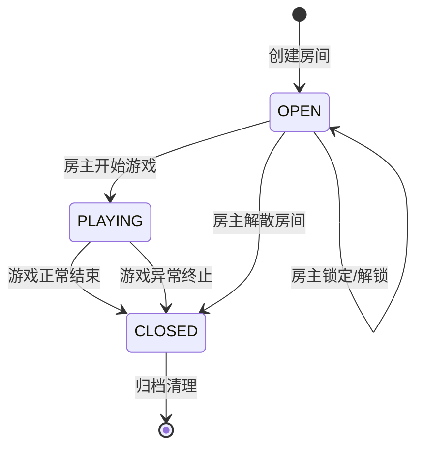

## D05 · 房间匹配与座位分配

### 1. 目标

规范从创建房间到游戏开始的整个生命周期管理，包括**建房、入房、观战、座位分配、准备和开局校验**。确保房间状态在并发场景下保持一致，席位分配无冲突，为游戏的顺利开始提供保障。

### 2. 房间生命周期与状态机

房间存在三种核心状态：`OPEN` (开放中), `PLAYING` (游戏中), `CLOSED` (已关闭/归档)。



### 3. 核心功能与约束

*   **房间配置**: 创建房间时可指定 `max_players` (范围 5-12, 默认 9) 和游戏角色配置。
*   **席位唯一性**: 在一个房间内，一个用户只能占据一个席位。使用数据库的唯一约束 `UNIQUE(room_id, user_id)` 和 `UNIQUE(room_id, seat)` 来保证。
*   **断线重连**: 玩家断线后，其席位将被保留一段时间（例如 5 分钟）。在此期间，玩家可以通过 `token` 重连并恢复会话。
*   **观战模式**: 观战者不占用游戏席位，数量理论上无限制（取决于广播能力）。对局开始后加入的玩家默认为观战者。
*   **房主 (Host)**: 创建房间的玩家默认为房主。房主拥有开始游戏、锁定房间、踢人、转移房主身份的权限。若房主退出，房主身份会自动转移给房间内最早加入的另一位玩家。

### 4. API 契约 (REST & WebSocket)

**RESTful API (控制面)**
```
# --- 房间管理 ---
POST /rooms                        # 创建房间, body: { maxPlayers, config } -> return Room
GET  /rooms                       # 获取房间列表（支持过滤）
GET  /rooms/{roomId}               # 获取特定房间详情（含座位表、状态）
POST /rooms/{roomId}/join          # 加入房间, body: { seat?: number } -> return Room
POST /rooms/{roomId}/leave         # 离开房间
POST /rooms/{roomId}/spectate      # 作为观众加入
DELETE /rooms/{roomId}             # 解散房间 (仅房主)

# --- 房主操作 ---
POST /rooms/{roomId}/lock          # 锁定/解锁房间
POST /rooms/{roomId}/start         # 开始游戏
POST /rooms/{roomId}/kick          # 踢出玩家, body: { userId }
POST /rooms/{roomId}/transfer-host # 转移房主, body: { userId }
```

**WebSocket Events (实时通知)**
*   **连接**: `wss://api.example.com/ws?token=JWT&roomId=...`
*   **服务端 -> 客户端**:
    *   `RoomStateUpdated`: 当房间属性（如状态、锁定、房主）变化时广播。
    *   `MemberListUpdated`: 当有玩家加入、离开、更换座位或准备状态变化时广播。
        ```json
        {
          "type": "MemberListUpdated",
          "payload": {
            "members": [
              { "seat": 1, "userId": "u-alice", "username": "Alice", "isReady": true },
              { "seat": 2, "userId": "u-bob", "username": "Bob", "isReady": false },
              { "seat": 3, "userId": null, "username": null, "isReady": false }
            ],
            "spectators": [
              { "userId": "u-charlie", "username": "Charlie" }
            ]
          }
        }
        ```

### 5. 并发安全与开局校验

*   **占座**: `JOIN` 请求必须是原子操作。推荐使用数据库的 `SELECT ... FOR UPDATE` 行级锁或 Redis 分布式锁来防止多个用户同时抢占同一个座位。
*   **开局前校验 (`/start` 接口)**:
    1.  **人数校验**: 当前就座人数是否满足游戏配置的最低要求？
    2.  **准备状态**: 所有已就座的玩家是否都已点击“准备”？
    3.  **配置合法性**: 角色配置是否有效（例如，狼人数量 > 0，好人阵营数量 > 0）？
    4.  **房间状态**: 房间是否为 `OPEN` 状态？
    *   任一条件不满足，则拒绝开局并向房主返回具体错误原因。

### 6. 边界用例处理

*   **开局瞬间有人退出**: 在 `start` 接口的事务处理中，再次检查人数。如果人数不足，则回滚事务并返回错误。
*   **指定座位已被占用**: `join` 接口返回 `409 Conflict` 错误，错误码为 `SEAT_TAKEN`。
*   **网络分区**: 客户端应能通过 WebSocket 的心跳机制检测断线，并自动发起重连。服务端应为断线用户保留席位。

### 7. 验收标准

*   **并发测试**: 模拟 100 个用户并发加入同一房间，验证不会出现重复席位或数据不一致的情况。
*   **断线重连**: 在游戏中途断开网络连接，然后在席位保留时间内重连，验证玩家可以无缝恢复到游戏界面和状态。
*   **流程完整性**: 能够完整地走通“创建->多人加入->准备->开始游戏->游戏结束”的流程，且每一步的房间状态和成员列表都符合预期。
*   **观战隔离**: 验证观战玩家在任何情况下都无法执行游戏内动作（发言、投票等），也无法看到非公开信息。