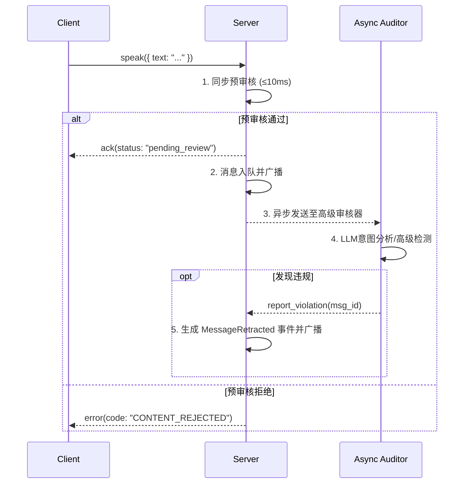

## D08 · 文本审核与反作弊

### 1. 目标

在保证游戏实时性的前提下，建立一套轻量级、多层次的**内容审核与反作弊机制**。该机制旨在主动识别并干预**辱骂、作弊信息泄露、刷屏**等不良行为，维护健康、公平的游戏环境。

### 2. 审核与反作弊策略

#### 2.1 文本内容审核

1.  **敏感词过滤 (本地词典)**:
    *   **技术**: 使用高性能的 Aho-Corasick 自动机算法（或类似的 Trie 树变种）实现敏感词匹配。
    *   **词库**: 维护一个动态的、可热更新的词库，包含辱骂、政治敏感、广告等类别。
    *   **处理**: 命中敏感词的消息可以被**拒绝**、**替换为星号(\*)** 或**进入人工审核队列**。

2.  **LLM 辅助审核 (可选)**:
    *   **技术**: 对于可疑文本，可以异步调用一个专门的、低成本的审核模型（如 `text-moderation-stable`）进行意图分析。
    *   **场景**: 用于识别传统关键词无法覆盖的“黑话”、隐喻性辱骂或作弊信息。
    *   **处理**: 异步审核结果可以触发对玩家的警告或临时禁言。

#### 2.2 行为模式反作弊

1.  **频率与重复限制**:
    *   **发言频率**: 使用**令牌桶算法**限制单个玩家在单位时间内的发言次数（例如，每 10 秒最多发言 3 次）。
    *   **内容重复**: 使用 **SimHash** 或 **Jaccard 相似度**算法检测短时间内的高度重复内容。连续发送相似内容的玩家将被警告或临时禁言。

2.  **越权信息泄露检测**:
    *   **目标**: 防止 LLM Agent 或人类玩家泄露其不应公开的身份信息。
    *   **技术**:
        *   **规则匹配**: `re.search(r"我是(预言家|狼人|女巫)", message)`。
        *   **LLM 意图分析**: 异步调用 LLM 判断发言是否“意图泄露自己的隐藏身份”。
    *   **处理**:
        *   对于 **LLM Agent**，GM Agent 在其发言前进行预检查。若发现泄露意图，则**拒绝本次发言**，并强制其重新生成。
        *   对于**人类玩家**，系统自动标记该消息，并可通知 GM 进行人工裁定。

3.  **反作弊暗号检测 (高级)**:
    *   **目标**: 检测玩家间通过预设的、看似无害的暗号传递信息（例如，“今天天气真好”=“我是预言家”）。
    *   **技术**: 这是一个难题。初期可通过统计玩家间的**异常发言模式**（例如，A 发言后 B 总会跟一个特定短语）来发现可疑行为，并提交人工分析。

### 3. 审核流程

### 4. 数据模型与日志

*   **`audit_logs` 表**: 记录所有审核和反作弊系统的决策。
    *   `{ id, game_id, event_idx, seat, phase, rule_triggered, action_taken, content_summary, score, ts }`
*   **监控指标**:
    *   `audit_pass_rate`: 审核通过率。
    *   `audit_block_rate`: 拦截率（按规则分类）。
    *   `audit_retraction_rate`: 异步撤回率。
    *   `audit_sync_latency_p95`: 同步预审核的 p95 延迟。

### 5. 验收标准

*   **性能**: 在 5000 房间、每房 9 人的满载情况下，同步预审核的 p95 延迟必须 **< 10ms**，不能成为游戏实时通信的瓶颈。
*   **准确性**:
    *   对于一个包含 100 个明确违规样本（辱骂、泄露身份）的测试集，拦截率应 ≥ 95%。
    *   对于一个包含 1000 个正常发言的测试集，误杀率应 < 1%。
*   **可追溯性**: 任何一次消息被拦截或撤回，都必须能在 `audit_logs` 中找到明确、详细的记录。
*   **Agent 约束**: 验证当 LLM Agent 试图生成“我是狼人”等违规发言时，其请求能被 GM Agent 稳定拦截，并强制其重新思考。