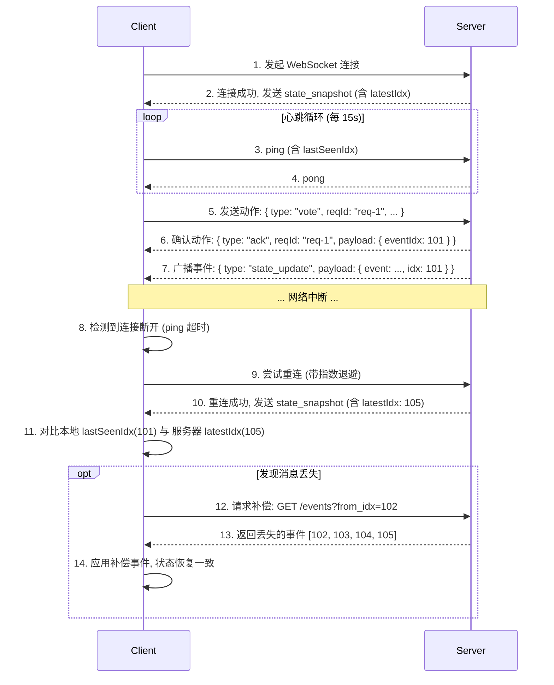

## D09 · WebSocket 协议与重连

### 1. 目标

定义客户端与服务器之间**实时通信的 WebSocket 协议**。内容涵盖连接握手、消息信封格式、心跳保活、ACK 确认机制，以及核心的**断线重连与消息补偿**流程。本规范是对 `Baseline.md` 5.4 节的详细阐述。

### 2. 连接与认证

*   **端点 (Endpoint)**: `wss://api.example.com/ws`
*   **连接参数**: 客户端必须在连接 URL 的查询字符串中提供身份令牌和房间 ID。
    `wss://api.example.com/ws?token=...&roomId=...`
*   **握手流程**:
    1.  服务器收到连接请求后，首先验证 `token` 的有效性。
    2.  接着校验用户是否有权限加入 `roomId` 对应的房间。
    3.  验证通过后，服务器接受连接，并立即向客户端下发一条 `state_snapshot` 消息，其中包含当前的游戏状态快照和最新的事件 `idx`，以便客户端初始化或同步其状态。

### 3. 消息信封 (Envelope)

所有在 WebSocket 上传输的消息，无论是上行还是下行，都必须封装在统一的信封结构中。

```json
{
  "type": "speak|vote|night_action|system|state_update|ack|error|ping|pong",
  "reqId": "client-generated-uuid-for-requests", // 客户端请求ID，用于匹配ack/error
  "ts": 1734103700123, // 客户端/服务器生成的时间戳
  "payload": {
    // ... 具体的消息内容 ...
  }
}
```

### 4. 心跳、ACK 与重连流程

这是保证连接稳定性和数据一致性的核心机制。



*   **心跳 (Ping/Pong)**:
    *   客户端每隔 15 秒向服务器发送 `ping` 帧，其中可包含客户端已收到的最新事件 `idx` (`lastSeenIdx`)。
    *   服务器收到 `ping` 后，立即回复 `pong` 帧，表示连接正常。
    *   如果客户端在 45 秒内（3 个心跳周期）未收到任何消息（包括 `pong`），则判定连接已断开，并启动重连逻辑。
*   **ACK 确认**:
    *   客户端发起的每一个**动作请求**（如 `speak`, `vote`）都必须携带一个唯一的 `reqId`。
    *   服务器处理完请求后，必须回复一个对应的 `ack`（成功）或 `error`（失败）消息，其中包含原始的 `reqId`。这让客户端能够确切地知道其请求已被服务器处理。
*   **丢包补偿**:
    *   重连成功后，客户端将服务器下发的 `latestIdx` 与本地的 `lastSeenIdx`进行比较。
    *   如果 `server_latest_idx > client_last_seen_idx`，说明在断线期间有事件丢失。
    *   客户端应立即通过 REST API (`GET /games/{id}/events?from_idx=...`) 请求从 `client_last_seen_idx + 1` 开始的所有缺失事件，以补齐状态。

### 5. 多端登录

*   **策略**: 默认情况下，一个用户在同一个房间的同一个席位上，只允许维持一个活跃的 WebSocket 连接。
*   **踢下线**: 当一个新连接建立时，如果服务器发现该用户/席位已存在一个旧连接，则会主动向旧连接发送一条 `force_disconnect` 消息，然后关闭旧连接。

### 6. 验收标准

*   **断线恢复**: 在测试中，手动断开客户端网络，并在 1 分钟内恢复。验证客户端能够在 5 秒内自动完成重连、消息补偿，并恢复到与服务器完全一致的游戏状态。
*   **动作不丢失/不重复**: 在弱网环境下（模拟 10% 丢包率），连续发送 100 次投票或发言动作。验证最终结果中，所有动作都只被成功执行了一次。
*   **心跳健壮性**: 验证在服务器长时间不推送任何业务事件的情况下，连接依然能通过心跳机制保持活跃，不会被意外关闭。